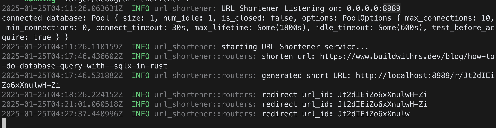
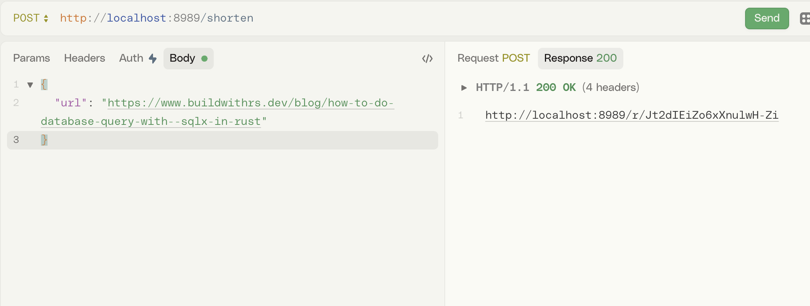
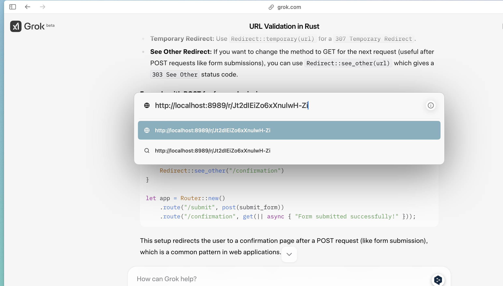
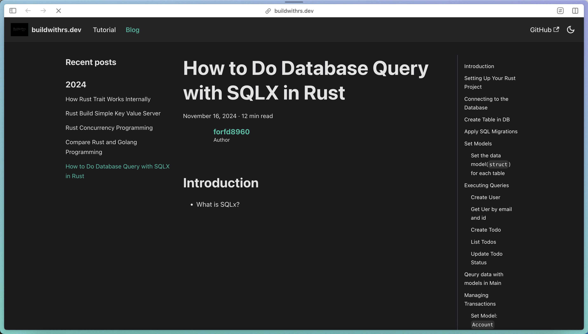

# url-shortener

## DB

* Apply SQL

```sh
❯ sqlx migrate add initial
Creating migrations/20250123121940_initial.sql
❯ sqlx migrate run
Applied 20250123121940/migrate initial (25.587667ms)
```

```sh
psql -U db_manager -d my_url_shortener
```

```sh
my_url_shortener=> \d short_urls
                                       Table "public.short_urls"
   Column   |           Type           | Collation | Nullable |                Default
------------+--------------------------+-----------+----------+----------------------------------------
 id         | bigint                   |           | not null | nextval('short_urls_id_seq'::regclass)
 origin_url | character varying(512)   |           | not null |
 url_uid    | character varying(64)    |           | not null |
 created_at | timestamp with time zone |           |          | CURRENT_TIMESTAMP
Indexes:
    "short_urls_pkey" PRIMARY KEY, btree (id)
    "short_urls_url_uid" UNIQUE, btree (url_uid)
```

## Run Server



## Gen Short URL



## Redirect to Original



